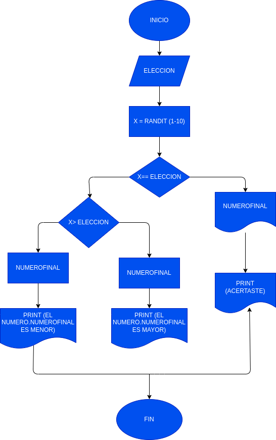

# adivina-el-numero

Adivina_numero_aleatorio
un programa para generar y adivinar un numero dado

# ANALISIS
Variables de entrada Eleccion : la variable en la que ingresamos un numero de 1 a 10

variables de proceso

X = es la variable donde se almacena el numero aletorio Numerofinal = donde de guarda el numero de la variable X para ser usada en el print

Variables de salida

Numerofinal = el numero aletorio almacenado para ser visto en el print

# DISEÑO

# construccion